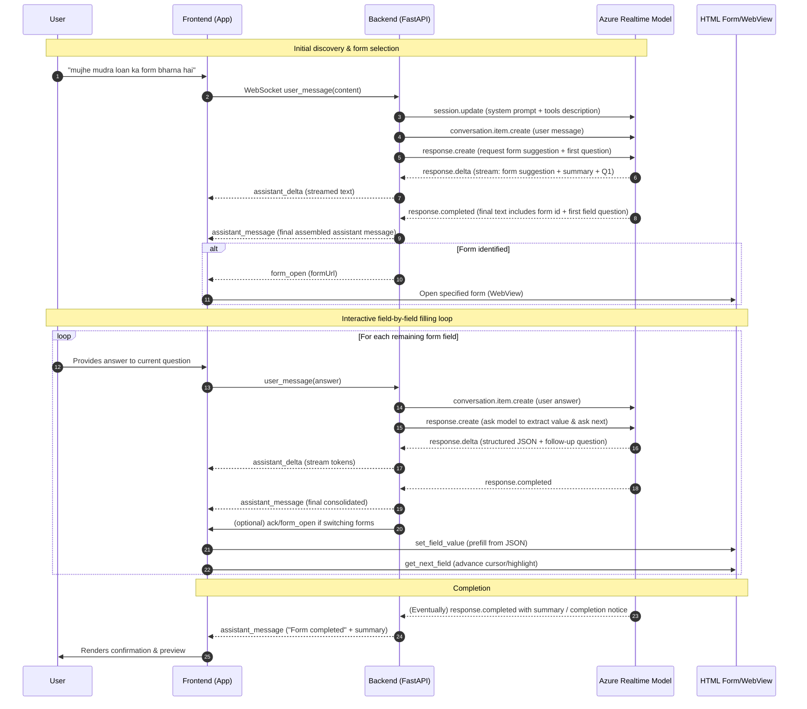

# End-to-End Form Filling Conversation Flow

## Legend
* `conversation.item.create` – Adds a user or assistant message item to the realtime conversation.
* `response.create` – Instructs the model to generate the next assistant response (streamed as `response.delta`).
* `assistant_delta` – Incremental text tokens forwarded from backend to frontend.
* `assistant_message` – Final assembled assistant response (end of turn).
* `form_open` – Backend instructs frontend to open/render a specific government form.
* Tool-like frontend actions (`set_field_value`, `get_next_field`) are triggered locally after model supplies structured JSON.

## High-Level Phases
1. Discovery & Form Selection – Identify correct form and load it.
2. Field Iteration – Repeated Q&A loop populating each form element.
3. Completion – Model or heuristic signals all required fields gathered; frontend presents confirmation.
