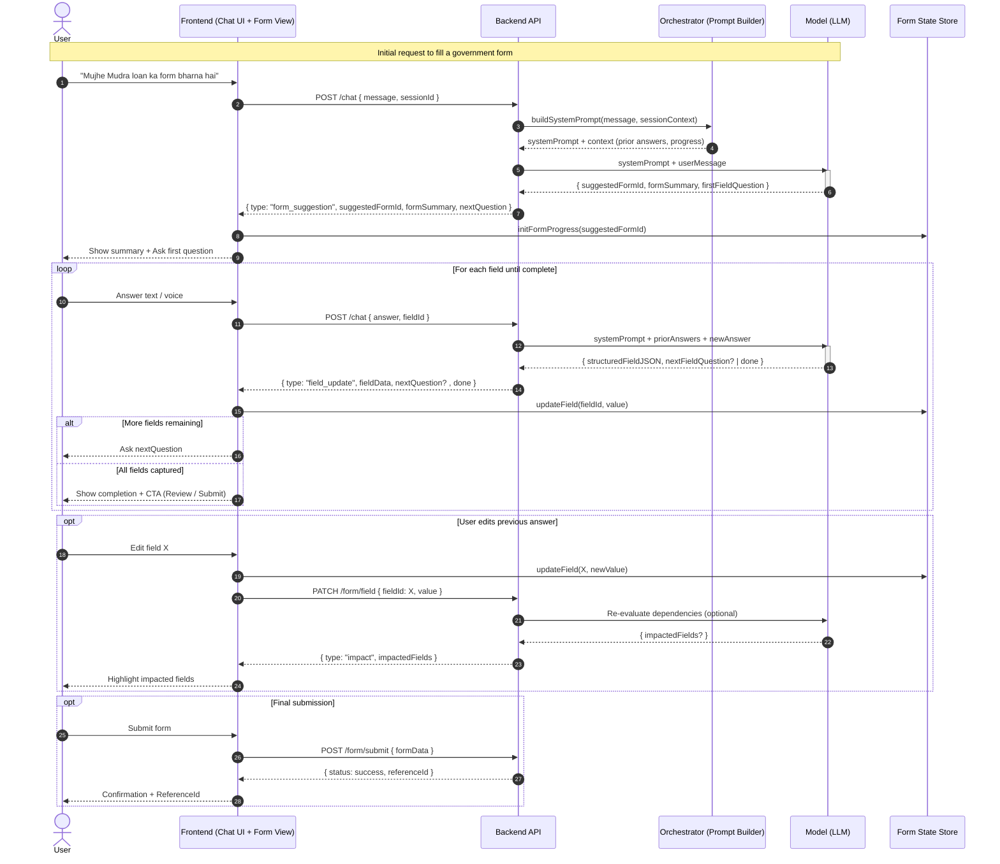

# User -> AI Assisted Form Filling Flow



## Legend
- Frontend handles UI (chat + form prefill) and maintains a local reactive form state store.
- Backend orchestrates prompts, tracks conversation/session state, validates AI JSON.
- Model outputs: (a) initial form suggestion + summary + first question, (b) per-field structured JSON + next question, (c) done signal when no more fields.
- Structured field JSON example:
```json
{
  "fieldId": "applicant_name",
  "label": "Applicant Name",
  "value": "Kishan Patel",
  "confidence": 0.94,
  "meta": { "source": "user_input" }
}
```

